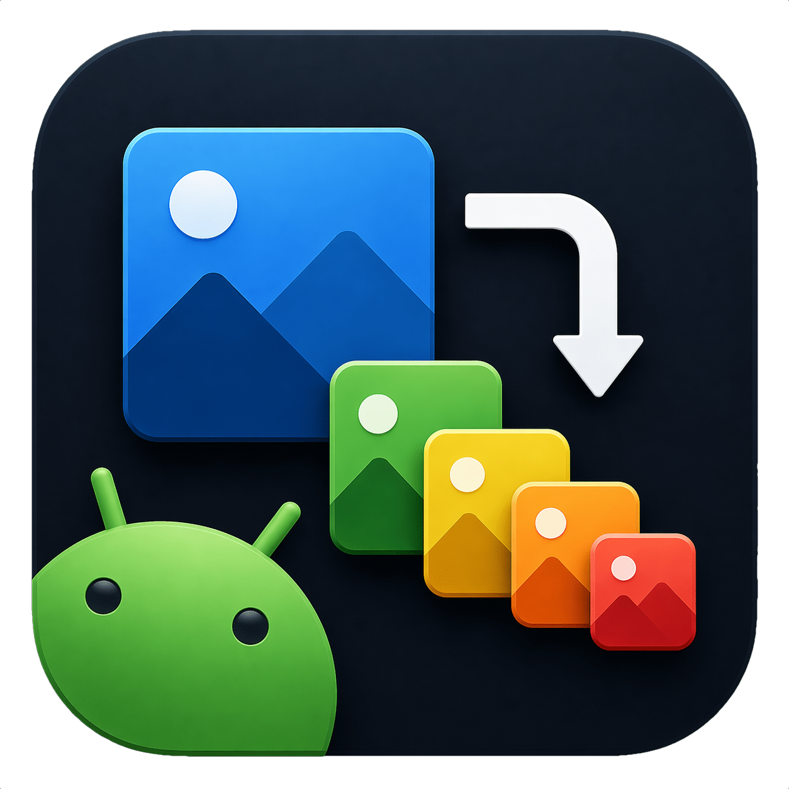
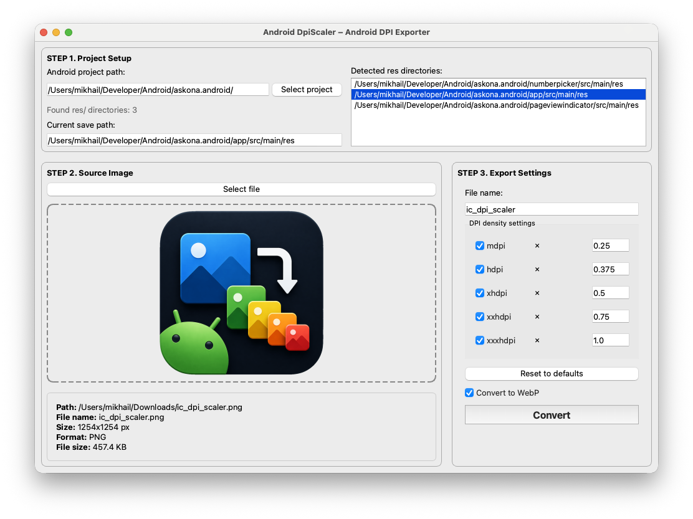

# Android DpiScaler
<p align="center">
  
</p>
Android DpiScaler — десктопный инструмент для генерации Android drawable-ресурсов из одного изображения.

Бросаешь картинку (как правило, в качестве исходника используется `xxxhdpi`). Инструмент сам создаёт все density-варианты (`mdpi`, `hdpi`, `xhdpi`, `xxhdpi`, `xxxhdpi`) и автоматически раскладывает их по соответствующим `res/drawable-*` папкам.

## ⚠️ Важно

Рекомендуется использовать исходник в `xxxhdpi`:
- это обеспечивает достаточное качество при масштабировании вниз  
- снижает риск артефактов и размытия на устройствах с высокой плотностью  
- позволяет корректно сформировать все остальные `drawable-*` ресурсы  


## Preview
<p align="center">
  
</p>

## Возможности
* Автоматически находит `res/` директории проекта  
* Drag-and-drop или выбор файла  
* Генерация всех density-вариантов
* Запись и создание файлов
* Поддержка `PNG` и `WebP`  

## Зачем это
Чтобы не делать руками:
* ресайз одной и той же картинки 5 раз  
* раскладку по `drawable-*` папкам  
* проверку, не забыл ли `xxhdpi`  

## Быстрый старт

```bash
python -m venv .venv
source .venv/bin/activate  # Windows: .venv\Scripts\activate
pip install -r requirements.txt
pip install -e .
python main.py
```

## Сборка

```bash
pip install -r requirements-dev.txt
pip install -e .
```

* macOS: bash packaging/scripts/build_macos.sh
* Linux: bash packaging/scripts/build_linux.sh
* Windows: ./packaging/scripts/build_windows.ps1

Артефакты: artifacts/

## Требования

* Python 3.11+
* macOS / Windows / Linux

## Лицензия

MIT — см. LICENSE
